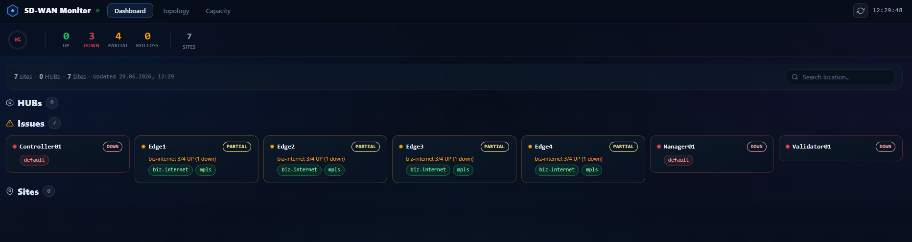
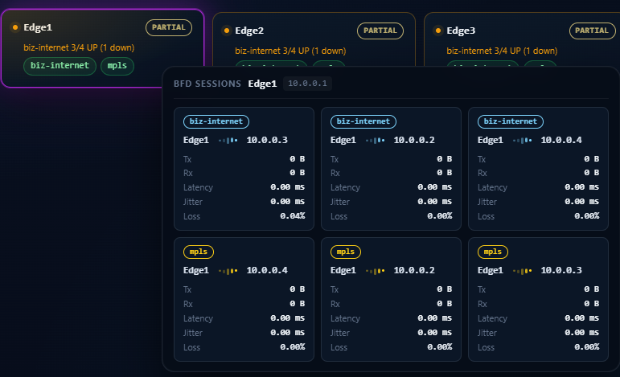
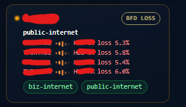

# SD-WAN Monitor

A real-time network health dashboard for Cisco SD-WAN (vManage) environments. Built with React + FastAPI, it surfaces BFD session health, TLOC status, and policy compliance in a clean, dark-themed UI — giving NOC engineers instant visibility without wading through vManage's interface.

---

## Screenshots

### Dashboard — Live Network Health Overview



The main dashboard shows every network node grouped by role. Issues (degraded, down, or BFD-loss devices) are pinned to the top for immediate triage. Edge sites in good health appear in the Sites section. SD-WAN controllers (vSmart, vBond, vManage) are automatically identified and excluded from the site count.

### BFD Sessions — Per-Transport Drill-Down



Hovering over any site card opens a live BFD session tooltip showing all active tunnels with transport type, remote peer, latency, jitter, and loss percentage. Color-coded loss thresholds make problem tunnels immediately obvious.

### BFD Loss — Inline Card Detail



When a device has BFD sessions with packet loss above the threshold (default 2%), the site card expands inline to show the affected transport, each session peer, and the exact loss percentage. No hover needed — the problem is visible at a glance on the dashboard.

---

## Features

| Feature | Description |
|---|---|
| **Real-time Dashboard** | Polls vManage every 60 s; shows UP / DOWN / PARTIAL / BFD LOSS per site |
| **Issues Section** | Devices with any problem state are always pinned at the top |
| **BFD Session Tooltip** | Per-transport tunnel detail (latency, jitter, loss %) on hover |
| **Controller Detection** | vManage, vSmart, vBond are identified by `personality` field — never shown as edge sites |
| **HUB Separation** | Hub routers shown in their own section, separate from branch sites |
| **Health Strip** | Compact status bar at the top: UP / DOWN / PARTIAL / BFD LOSS counts at a glance |
| **Live Delta Banner** | Animated notification when any device changes state between polls |
| **Policy Compliance** | Shows which policy group each site belongs to and whether it's up-to-date |
| **Capacity View** | Interface throughput capacity utilization across the fleet |
| **Topology View** | TLOC and BFD session connectivity map |
| **Search** | Filter devices by hostname in real time |

---

## Architecture

```
Browser (React + Vite)
    │
    │  /sdwan/*  (nginx reverse proxy)
    ▼
FastAPI (Python 3, uvicorn)
    │
    │  REST API (cookie auth + XSRF token)
    ▼
Cisco vManage
  /dataservice/device
  /dataservice/device/tloc
  /dataservice/device/bfd/tloc/detail
```

The backend caches all vManage data in memory and refreshes it on a configurable interval (default 60 s). The frontend reads only from the backend — no direct vManage calls from the browser.

---

## Quick Start

### Prerequisites

- Python 3.10+
- Node 18+ (for rebuilding the frontend)
- Access to a Cisco vManage instance

### Backend

```bash
python3 -m venv venv
source venv/bin/activate
pip install fastapi uvicorn httpx python-dotenv

cp .env.example .env
# Edit .env with your vManage credentials
```

**.env.example:**
```env
VMANAGE_HOST=https://your-vmanage.example.com
VMANAGE_USER=admin
VMANAGE_PASS=yourpassword
FRONTEND_ORIGIN=http://localhost:5173
POLL_INTERVAL_SECONDS=60
VERIFY_TLS=false
```

```bash
uvicorn backend:app --host 0.0.0.0 --port 8000
```

### Frontend (development)

```bash
npm install
npm run dev
```

### Frontend (production build)

```bash
npm run build
# Copy dist/assets/* to your web root
```

---

## Deploying Behind nginx

Add a proxy location to your nginx config so the frontend can reach the backend without CORS issues:

```nginx
location /sdwan/ {
    proxy_pass http://127.0.0.1:8000/;
    proxy_set_header Host $host;
    proxy_set_header X-Real-IP $remote_addr;
}
```

Then set `FRONTEND_ORIGIN` to your domain in `.env`.

---

## Device Classification

The backend uses the vManage `personality` field to classify devices:

| Personality | Role | Shown in |
|---|---|---|
| `vedge` | Branch/site router | Sites / Issues |
| `vsmart` | SD-WAN controller | Excluded |
| `vbond` | SD-WAN validator | Excluded |
| `vmanage` | SD-WAN manager | Excluded |

Hub routers are identified by hostname prefix (`HUB-`) and shown in a dedicated HUBs section.

---

## Testing Against Cisco DevNet Sandbox

You can test against the Cisco SD-WAN Always-On sandbox at no cost:

```env
VMANAGE_HOST=https://sandbox-sdwan-2.cisco.com
VMANAGE_USER=devnetuser
VMANAGE_PASS=RG!_Yw919_83
VERIFY_TLS=false
```

---

## Tech Stack

**Frontend:** React 18, Vite, TanStack Query, Framer Motion  
**Backend:** FastAPI, httpx, Python 3.10+  
**Deployment:** nginx, systemd, Docker (optional)

> **No internet access required.** The frontend is built with Vite into a fully self-contained static bundle — all JavaScript and CSS is bundled at build time with no CDN dependencies. Once built and served, the entire stack (frontend + backend) runs air-gapped and only needs network access to reach your vManage instance.

---

## License

MIT — free to use, fork, and adapt.

---

*Built to fill a gap: vManage's built-in dashboard is functional but noisy. This project strips it down to what NOC engineers actually need on a wall monitor.*
